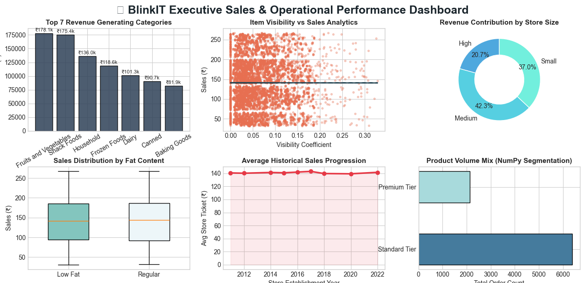

#  Automated Retail Analytics & Dashboards

##  Project Overview
This project focuses on engineering an end-to-end automated data analytics pipeline and an executive-level performance dashboard for quick-commerce retail operations using **Python, Pandas, NumPy, and Matplotlib**. By analyzing transactional, structural, and behavioral store variables from a complex retail dataset (BlinkIT), this solution extracts critical business insights, automates corporate reporting, and delivers high-impact visualizations within a single structural interface.

The main objective is to shift away from manual spreadsheet computation and transition toward dynamic, code-driven computational logic. This infrastructure maps revenue models, resolves missing data integrity issues, segments customer behaviors, and visually exposes systemic sales paradoxes to empower corporate decision-making.

---

##  Data Stack & Engineering Architecture
The pipeline is entirely built using a native Python analytical workflow, optimizing operations through three core layers:
1. **Pandas (Data Wrangling & Imputation):** Handled advanced structural cleaning by resolving category naming inconsistencies (e.g., standardizing text typos like 'low fat' and 'LF' into 'Low Fat'). Implemented group-level statistical transformations to fill 1,463 missing product weight parameters (`NaN` values) using a calculated category-specific mean threshold rather than dropping crucial transaction data.
2. **NumPy (Advanced Vectorized Calculations):** Utilized high-performance numerical operations to compute core financial aggregates like the 90th percentile sales boundaries. Computed dynamic feature engineering matrices using conditional logical structures (`np.where`) to classify items into distinct consumer pricing brackets ('Premium Tier' vs 'Standard Tier') and executed statistical matrix correlation models (`np.corrcoef`).
3. **Matplotlib (Dynamic Dashboard Engineering):** Structured a compressed, custom-styled 2x3 grid matrix to generate a centralized dashboard saved as a high-density, production-ready vector image (`dpi=300`) with zero clipping layout adjustments.

---

## Single-Frame Executive Dashboard

The complete programmatic analysis is packed and rendered into one comprehensive business dashboard file:

---

##  Key Business & Operational Insights Delivered

* **Top Revenue Champions:** Diagnostic analysis proves that `Fruits and Vegetables` along with `Snack Foods` serve as the primary structural revenue drivers, netting the highest corporate order volume across all fulfillment hubs.
* **The Visibility Paradox Explored:** Through mathematical correlation modeling, the relationship coefficient between screen shelf placement (`Item Visibility`) and final conversion (`Sales`) returned a near-neutral value of `-0.0013`. This critical finding proves that visibility indexing alone does not increase sales traction without core underlying product baseline demand.
* **Store Footprint Optimization:** Cross-sectional aggregation shows that `Medium` footprint stores heavily outperform large or hyper-localized configurations, contributing a dominant **42.3%** share to the network's aggregate revenue distribution.
* **Consumer Wellness Segmentation:** Structural group analysis reveals a noticeable customer pattern preference shifting towards healthier product variations, with `Low Fat` categorized items driving the highest revenue contribution trends.
* **Cohort Progression Analytics:** Time-series trends evaluated across store establishment years successfully isolated high-stability fulfillment centers that maintain consistent average order tickets over long historical windows.

---

##  Repository Structure
* `blinkit_project.py` - Core automated execution script containing data preparation, mathematical layers, and dashboard code.
* `blinkit_dashboard.png` - Automated high-resolution analytical dashboard image.
* `README.md` - Complete technical overview and documentation of findings.
